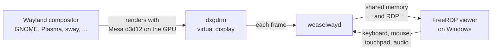

# Weaselway

[](https://discord.gg/6HG8ac8XWZ)

A GPU-accelerated Linux desktop on WSL2, shown in a window on Windows and
distributed as a NixOS-WSL image.

Weaselway is for people who have to work on a Windows machine but would rather
use a Linux desktop while they do.

https://github.com/user-attachments/assets/4867b0d8-d69e-49d9-93f8-eb8ae73222fd

WSLg puts individual Linux application windows on the Windows desktop. Weaselway
runs a complete session instead: GNOME, Plasma, sway or another compositor, in
one window, with GPU acceleration, audio and the clipboard.


Chromium runs fully GPU-accelerated, and a GNOME session holds 60 fps at
2560x1440 on a ten-year-old laptop.

<!-- IMAGE: a screenshot of the viewer's `/sdl-show-stats` overlay on that
     laptop at 2560x1440 showing 60 fps. Name the laptop and its GPU in the
     caption, so "ten-year-old laptop" becomes a checkable claim (ARCHITECTURE.md
     in weaselway names an Intel HD 630 as a tested GPU). -->

## Getting it

You need Windows with WSL2 on an x86_64 machine and a GPU whose Windows driver
supports WSL. The image is about 1.4 GiB. It works with one WSL kernel release,
currently `6.18.33.2-microsoft-standard-WSL2`, so a `wsl --update` that changes
the kernel stops it until a new release catches up.

1. Download `nixos-weaselway-gnome-<version>.wsl` or
   `nixos-weaselway-plasma-<version>.wsl` from the
   [latest release][releases-latest] and import it in PowerShell:

   ```powershell
   wsl --install --from-file nixos-weaselway-<desktop>-<version>.wsl --name Weaselway
   ```

2. Start Weaselway, then run `ww-start-session` and `ww-start-viewer` inside
   it.

The [weaselway] README has the full instructions, including how to uninstall.

<!-- VIDEO (60-90 s screencast, linked here rather than embedded): from an empty
     PowerShell window to the desktop, covering the two steps above. Link it
     as "Watch the installation" so the page stays light. -->

The system is a NixOS flake in `/etc/nixos`. To update it, run
`nix flake update` and `nixos-rebuild switch`. The patched packages are
prebuilt on [weaselway.cachix.org][cachix], and
`nixos-rebuild switch --rollback` undoes an update.

## Status

GNOME and Plasma work, on one WSL kernel release at a time. The clipboard works in GNOME sessions only, for text and
images but not files. Audio from web browsers can crackle, and the scale factor
of the Windows display is not passed on. The [weaselway] README lists the
limitations.

## How it works

Any compositor with a KMS backend can run this way. The image includes GNOME,
Plasma is an option in its configuration, and sway, Weston, Hyprland and others
start through a session script.

An unmodified Wayland compositor drives a virtual display, which a small kernel
module provides, the same way it would drive a monitor. Mesa's `d3d12` Gallium
driver renders on the GPU that Windows exposes. A daemon reads each frame and
passes it through shared memory to a FreeRDP client on the Windows side.



The [weaselway] repository has a more detailed diagram.

## Repositories

| Repository | What it is |
|---|---|
| **[weaselway]** | **Start here.** The NixOS module, the image flake and `weaselwayd`, the daemon that reads the compositor's frames back, serves them over RDP on a vsock, and turns the client's keyboard, mouse and touchpad into ordinary input devices. |
| [dxgdrm] | The kernel module. It gives `d3d12` a real `/dev/dri/renderD128`, which WSL does not create, and gives the compositor a virtual display to drive. |
| [mesa] | The `d3d12` Gallium driver, with the dma-buf and sync-file changes needed to share buffers and fences on WSL and to scan out on dxgdrm. |
| [freerdp] | The SDL FreeRDP client for Windows. It is part of the image, and `ww-start-viewer` runs it from there. |
| [mutter], [kde-kwin] | One fix each, neither specific to Weaselway, kept on a branch until it is merged upstream. The image applies them as patches to the compositors from nixpkgs. |

The image is x86_64 and is built on nixos-26.05 with an unmodified
[NixOS-WSL].

## A note on AI

AI was used heavily throughout this project. This is not meant to be a
beautiful piece of software — it is meant to solve a problem I have: I want
to be able to use GNOME on my Windows machine.

[weaselway]: https://github.com/weaselway/weaselway
[releases-latest]: https://github.com/weaselway/weaselway/releases/latest
[mutter]: https://github.com/weaselway/mutter
[kde-kwin]: https://github.com/weaselway/kde-kwin
[mesa]: https://github.com/weaselway/mesa
[dxgdrm]: https://github.com/weaselway/dxgdrm
[freerdp]: https://github.com/weaselway/freerdp
[cachix]: https://weaselway.cachix.org
[NixOS-WSL]: https://github.com/nix-community/NixOS-WSL
